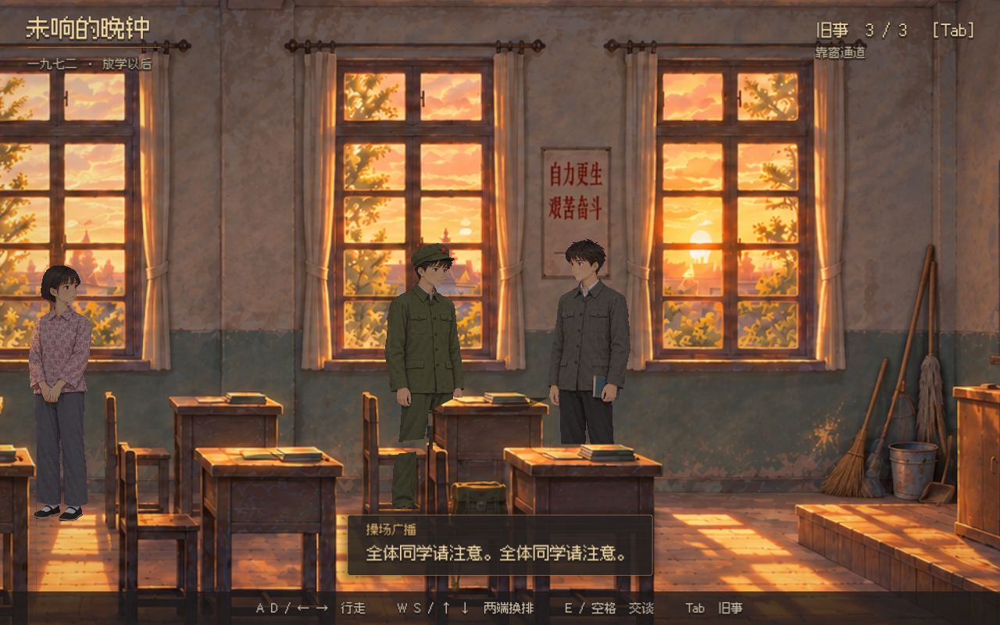

# Echoes After Class Demo

**未响的晚钟** — A nostalgic classroom narrative demo built with Godot.

1972 年，放学以后。教室里的三位同学，对同一天留下了互相矛盾的记忆。一个约五分钟的原创虚构叙事 Demo，探索夕阳、旧教室与淡淡的青春忧伤。



## Windows 下载

从 [Releases](https://github.com/kxn/echoes-after-class-demo/releases) 下载 Windows x64 ZIP，完整解压后运行 `WeixiangDeWanzhong.exe`。保留同目录 `.pck` 文件，无需安装 Godot。

## 从源码运行

使用 Godot 4 普通版（不需要 .NET），导入 `project.godot` 后按 **F5**。已在 Godot **4.7.2**、Windows、Compatibility / OpenGL 3.3 下验证。引擎不随源码提供。

若 `godot` 在 PATH 中，可运行 `Start.cmd` 或 `./Start.ps1`；也支持将引擎放在 `.tools/godot/`，该本机目录不会提交。

## 操作与流程

| 输入 | 操作 |
|---|---|
| A / D 或左右方向键 | 行走 |
| W / S 或上下方向键 | 在教室两端换排 |
| 点击地面 / 人物 | 沿通道移动 / 接近交谈 |
| E / 空格 / Enter | 交谈、补全、继续 |
| Tab / Esc | 查看旧事 / 关闭面板或中断对白 |
| M | 静音 |
| G / L / R / N / T / F1 | 眩光、人物增亮、桌面投影、法线、光向和通道调试 |

与沈禾、周槐生、唐小满交谈，收集三件旧事；再到右侧靠窗通道的“窗中人”提示处触发结尾。铃声后是约 38 秒操场广播，周槐生离场，其余两人改变说辞。无战斗、失败条件或跨次运行存档。

## 场景实现

- 长于两屏的绘画背景，右侧黑板与讲台，两条水平通道在两端连接。
- 3D 正交摄影机与带透明纹理的面片，实现二维画面的深度遮挡。
- 桌椅直接截取完整绘画，保留原本夕阳明暗；人物辅助法线和响应图只增加合适部位的窗光。
- 当前动画轮廓沿夕阳方向投射到桌面，柔化阴影边缘；背光朝向不叠加窗格高光。
- 视频生成后截帧抠图，按位移播放步行，落脚帧驱动脚步；主角有起停过渡，站立角色有错时眨眼和轻微呼吸。
- 头顶对白、暖纸色像素字体、细金线交互图标；结尾使用合成校园广播与旧扩音器音色。

这是美术与交互原型。人物与物体仍是面片，法线为近似；后门是静态绘景，没有开合动作。实现与已知限制见 [场景架构](docs/painted/architecture.md)、[广播与离场](docs/broadcast/changes.md)。

## 验证与导出

```sh
godot --headless --path . -- --test
godot --headless --path . --script tools/test_broadcast.gd
godot --path . -- --capture
python tools/verify_painted_assets.py
```

Python 素材工具依赖见 `tools/requirements.txt`。已通过 540 项场景断言、广播流程检查和 69 项素材/渲染检查。渲染检查需要先生成截图；报告写入被忽略的 `docs/` 文件。

安装与引擎版本一致的 Windows 导出模板，创建 `dist/windows/` 后执行：

```sh
godot --headless --path . --export-release "Windows Desktop" dist/windows/WeixiangDeWanzhong.exe
```

## 仓库范围与素材来源

提交运行所需的完整纹理图集、音频、字体、场景、代码、导出配置、测试与制作脚本。引擎、缓存、Windows 构建、参考资料、原始生成视频、逐帧中间文件和历史录像不进入 Git。Windows 构建通过 Releases 分发。

无需生成服务即可运行。`tools/submit_*.py` 是可选制作工具，需自行部署兼容 H3 服务并设置 `H3_BASE_URL`；重建素材还需要未随仓库发布的原始输入。历史制作记录中提到的源视频和本地审片文件不属于运行依赖。

背景、角色图像和动画使用生成工具制作；剧情与广播稿为原创虚构。没有打包《十三机兵防卫圈》的截图、音乐或其他原作资源。

字体为 Fusion Pixel，保留 [OFL 及派生字体声明](assets/fonts/OFL.txt)；脚步素材来自 Kenney CC0，广播使用 Windows 本机 Huihui 合成语音，详见 [音频来源](assets/audio/LICENSE.md)。第三方内容遵循各自许可证；本仓库暂未对自有代码和美术统一授予开源许可证。
